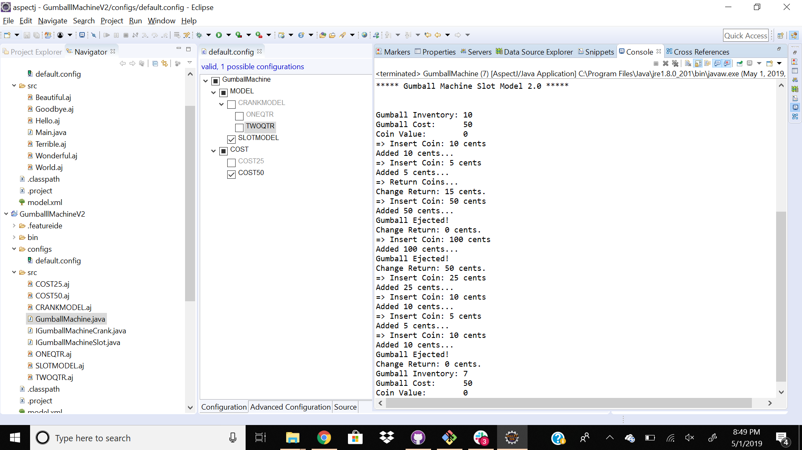
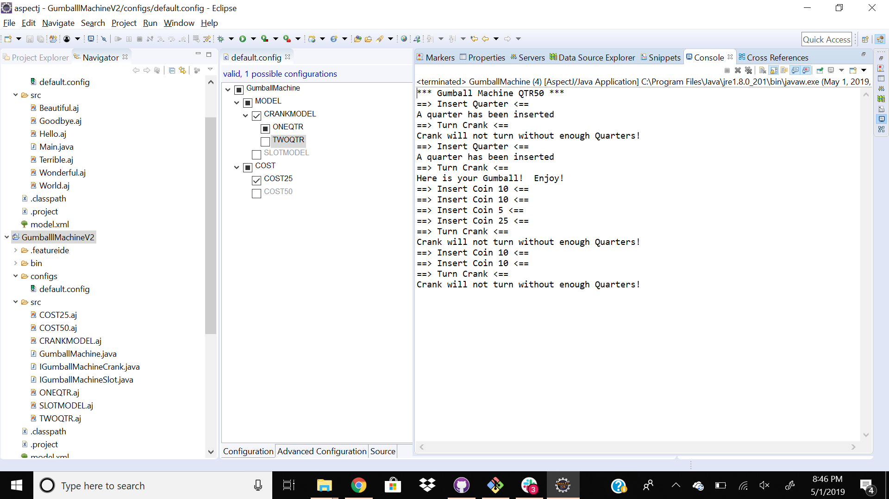
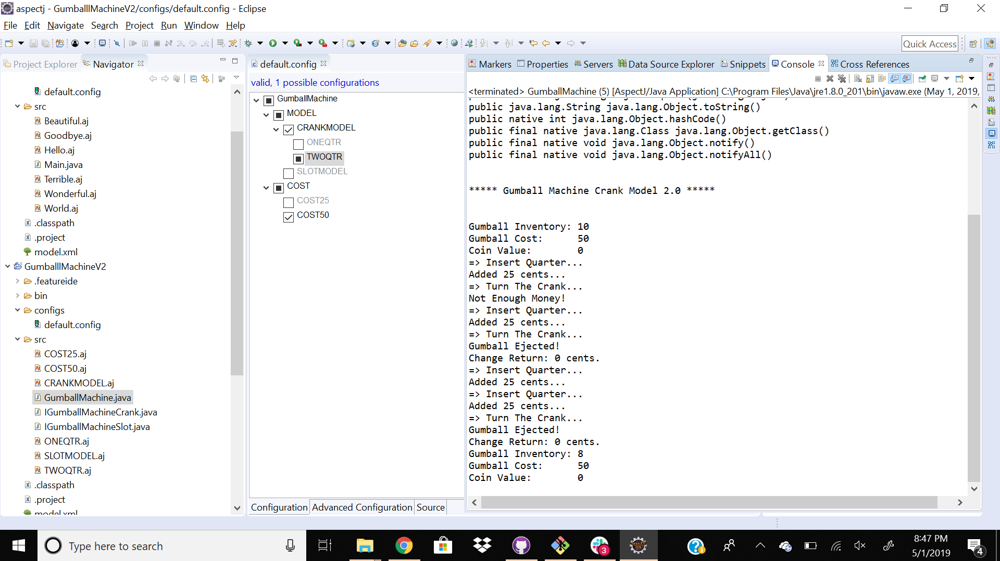

## Lab 10

**Comparison**

In Lab1, we were required to support different models for gumball machines which accepts different coins. So, I declared three different objects for each variant, any changes in the requirement made me change large portion of my source code.

While in this lab, with the use of AspectJ and FeatureIDE, config file is managing all the congigurations (or variants). Type of the model can be selected before running the code. It made source code easily manageable and in addition if new requirement comes it can easily adapt those requirements as well.

**Screenshots**

 - Slot Model: one quarter(cost 25) 
 
 - Slot Model: two quarter (cost 50) 
 
 - Crank Model: two quarter (cost 25) 
 
- Crank Model: two quarter (cost 50) 
 
